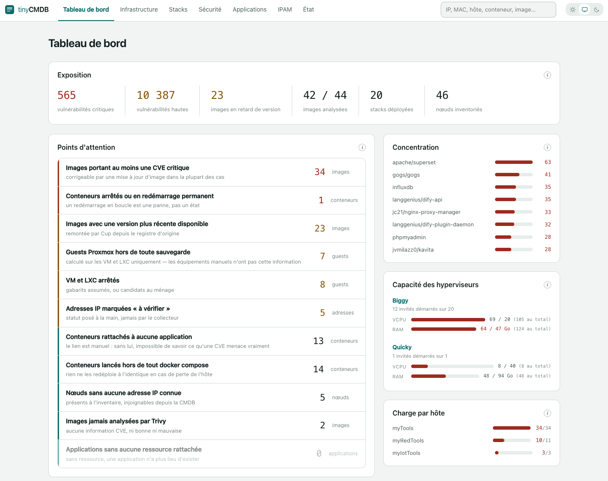
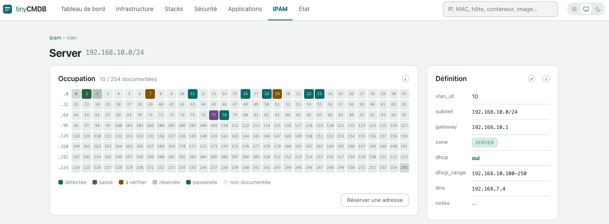
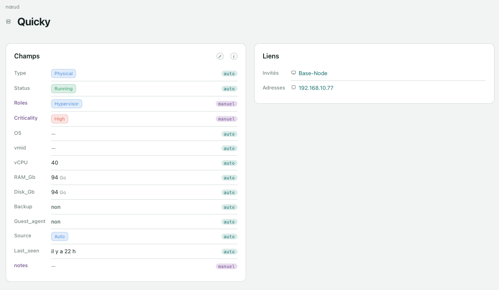

# TinyCMDB

**A homelab inventory, and nothing more.** A collector that discovers Proxmox
and Docker, scans images for vulnerabilities and pending updates, and a web
console that tells you, field by field, what it wrote and what you typed.

*Code comments and interface are in French.*

<br clear="left">

---

A homelab CMDB always decays the same way: you type something useful into it, a
script overwrites it on the next pass, you never notice, and you stop trusting
it. TinyCMDB solves one problem, but completely: **knowing, field by field, who
owns what** — and never letting you type into a field whose disappearance is
already scheduled.

Everything else follows. A collector that only touches what it owns. A console
that only opens for editing what will survive. A database that reflects what is
in place rather than a history of what used to be.

<p align="center">
  
</p>
<p align="center">
  
  
</p>

### What it does

- **Discovers** Proxmox nodes (hypervisors, VMs, LXC containers) and the
  containers on each Docker host, through a read-only socket proxy.
- **Scans** images with [Trivy](https://github.com/aquasecurity/trivy) (CVEs)
  and [Cup](https://github.com/sergi0g/cup) (available updates).
- **Keeps an IPAM** per VLAN, with an occupancy grid of the /24 where a free
  cell is a link to reserving that very address.
- **Connects it all**: hypervisor → guest → container → image → CVE, with IP
  addresses cutting across — which turns "this image carries 41 critical
  vulnerabilities" into "*this* service is affected".
- **Deletes** what has disappeared, after a grace period, and shows it coming.

### What it isn't

This is not NetBox, GLPI or i-doit. No asset lifecycle management, no ticketing,
no approval workflow, no multi-tenancy, no history. The project targets a few
hundred rows — an estate one person can hold in their head — and that ceiling is
not a limitation to work around, it is the goal: have what you need and no more.
If the inventory grows heavy, the thing to look at is the infrastructure, not
the code.

## Why Baserow, and not SQLite?

It is the first question the design invites, and it deserves a straight answer.
A few hundred rows would fit in a SQLite file with room to spare, and shipping
one would remove a Django, a Postgres and a Redis from the picture.

Storage is the easy part. What Baserow provides is everything *around* the rows,
and that is the part nobody wants to write:

- **A schema you can change without a migration.** Add a field in Baserow and
  both the collector and the console pick it up by name. With SQLite you would
  write the `ALTER`, the migration path, and eventually a schema editor.
- **Select options you can add without a deploy.** A new asset type, a new role,
  a new criticality level: three clicks, no release.
- **A working door to your data when the console does not cover a case.** Paste
  thirty rows, fix a botched import, mass-correct a typo. In a CMDB the manual
  data is precisely where the unforeseen happens — and if you are the only
  operator, a bug in the console must not lock you out of your own inventory.

The cost is stated plainly: a collaborative spreadsheet engine running for a few
hundred rows, an API with no joins and no aggregates — which is why the whole
graph is rebuilt in memory in `app/web/store.py` — and a database token that can
be scoped neither by origin nor by row, which is the entire reason the console
exists as a server-side service rather than a static page.

If that trade ever stops being worth it, the exit is deliberately narrow:
`app/web/ecriture.py` is the only module in the web service that writes, and
everything else knows nothing but `fetch_all`. Swapping the storage means
rewriting that file, and only that one.

### Requirements

- **[Baserow](https://baserow.io/)**, used as storage. TinyCMDB ships no
  database of its own: it writes to six Baserow tables over the API. See
  [Data model](#data-model) for their structure.
- **Docker** and **Docker Compose**.
- At least one thing to inventory: a **Proxmox VE** cluster and/or **Docker**
  hosts reachable through a socket proxy.

## Installation

**1. Prepare Baserow.** Create a database and its six tables, with the fields
listed under [Data model](#data-model). Then create two *database tokens*
(Settings → API tokens) — never the admin JWT, which can alter your schema:

| Token | Rights |
|---|---|
| collector | create, read, update, delete on all six tables |
| console (`WEB_BASEROW_TOKEN`) | read on all six; update where manual fields exist; create on `Ipam` and `Application` only; **delete nowhere** |

The second token is optional but recommended: it is the one living in the
process a browser talks to, and those four checkboxes are the only granularity
Baserow offers.

**2. Prepare the sources.** A Proxmox API token created with `--privsep 0`
([details](#proxmox-setup)), and a socket proxy on each Docker host
([details](#docker-setup-socket-proxy)). Either one alone is enough to start.

**3. Clone and configure.**

```bash
git clone https://github.com/YOUR-ACCOUNT/tinycmdb.git
cd tinycmdb
cp .env.example .env
chmod 600 .env
$EDITOR .env      # BASEROW_URL, BASEROW_TOKEN, TABLE_*, PROXMOX_URL and/or DOCKER_HOSTS
```

**4. Set the published address.** In `compose.yaml`, replace
`192.168.10.11:8080:8080` with your host's own address on your management VLAN.
Never `0.0.0.0`: this console aggregates the entire inventory and has no
business on your other segments.

**5. Prepare the Trivy cache** — a bind mount, and the container runs as UID
1000, so it cannot chown the directory itself:

```bash
mkdir trivy-cache && sudo chown 1000 trivy-cache
```

Skip it with `TRIVY_ENABLED=false` if you do not want vulnerability scanning;
the Security screen will then have nothing to show.

**6. Start.**

```bash
docker compose up -d --build
docker compose logs -f collector
```

The first pass takes a few minutes if Trivy has to download its vulnerability
database (~1 GB, cached afterwards). The console is immediately available on
port 8080 of the address set in step 4; until the first pass completes, it will
honestly tell you the inventory is empty.

**To develop without rebuilding on every line**, mount the code over the image:

```bash
cp compose.override.yaml.example compose.override.yaml
docker compose up -d          # ./app is now mounted read-only
docker compose restart web    # after a change
```

That override is git-ignored and has no place on a production host: the point of
an image is that what runs is exactly what was built.

To run a single pass instead of waiting for the loop: set `RUN_ONCE=true` in
`.env`, then `docker compose run --rm collector`.

## Using it

Seven screens, and one idea running through all of them: what the collector owns
is shown, what is yours can be edited.

**Find what needs attention.** The dashboard is not a set of decorative
counters: it is a list of clickable work queues, ordered by what costs the most
if ignored — images carrying critical CVEs, versions behind, containers running
outside any Compose project, containers attached to no application, nodes with
no known IP address. An empty queue is the good news of the day.

**Track vulnerabilities.** *Security* lists every image by severity, with the
version Cup found available and Trivy's CVE counts. The column that matters is
the last one: which applications are affected. An image with critical CVEs and
no application attached is a vulnerability whose business impact cannot be
established — which is a finding in itself.

**Read the infrastructure.** *Infrastructure* separates hypervisors and their
guests from the physical estate. A tick or a cross to the left of each name says
whether it is up; the type and roles are tags on the line.

**Manage addresses.** *IPAM* shows one grid per VLAN, one cell per address of
the /24. Clicking an undocumented cell opens the reservation form with the
address already filled in: give it a MAC, a node, a type, and the row is created
as a manual entry — which the collector will never delete, even though nothing
answers at that address.

**Correct a field.** Open any record and click the pencil next to the help
button. Only the fields the collector never rewrites are offered. This is
enforced server-side, so the console cannot promise you an edit that would
silently vanish on the next pass.

**Declare an application.** *Applications* → *New application*. An application
is a grouping you decide — it may span several stacks, or a VM with no Docker at
all. Attaching containers to it is what turns "this image carries 41 critical
vulnerabilities" into "*this* service is affected".

**Check the plumbing.** *Status* shows each component of the CMDB itself and,
more usefully, the rows on borrowed time: what the collector no longer sees and
will actually delete, with the remaining delay.

## Local development (without Docker)

```bash
python3 -m venv .venv
source .venv/bin/activate
pip install -r requirements.txt
export $(grep -v '^#' .env | xargs)  # or source a separate file
cd app && python -m collector.main
```

The web console starts from the same `app/` directory:

```bash
cd app && uvicorn web.main:app --host 0.0.0.0 --port 8099 --reload
```

The `cup` and `trivy` binaries only exist inside the image. To test them outside
Docker, extract them from their official images into the venv:

```bash
id=$(docker create ghcr.io/sergi0g/cup) && docker cp "$id:/cup" .venv/bin/cup && docker rm "$id"
id=$(docker create aquasec/trivy) && docker cp "$id:/usr/local/bin/trivy" .venv/bin/trivy && docker rm "$id"
```

## Proxmox setup

The API token **must** be created with `--privsep 0`. This is the most common
trap on the subject: with privilege separation enabled, the token inherits no
permissions at all and the API returns an empty list **with no explicit error** —
nothing crashes, the inventory is simply empty. The collector logs a specific
warning for this case (see `sources/proxmox.py`), but it is better known in
advance:

```bash
pveum user add cmdb@pve --comment "TinyCMDB collector"
pveum acl modify / --users cmdb@pve --roles PVEAuditor
pveum user token add cmdb@pve collector --privsep 0
```

## Docker setup: socket proxy

The collector never talks to the Docker socket over raw TCP — that is equivalent
to root. Deploy `socket-proxy.compose.yaml` on **every** Docker host you want
inventoried (usually a Proxmox VM):

```bash
docker compose -f socket-proxy.compose.yaml up -d
```

What matters in that file:

- The port is bound to the management VLAN IP, never `0.0.0.0` — Docker
  manipulates iptables directly and bypasses the host's ufw rules.
- `POST=0`, `read_only: true`, socket mounted `:ro`: strictly read-only.
- `CONTAINERS=1` and `IMAGES=1` only; nothing else is exposed.

In `DOCKER_HOSTS`, the name given to each host **must match exactly** its
`Node.name` as discovered by Proxmox. Any spelling difference (case, hyphen,
etc.) leaves `Container.host` empty with no error — this is the first problem
most people hit. The collector detects the case and logs a warning listing the
unresolved names on every pass.

### Automatic Docker host discovery

Rather than maintaining `DOCKER_HOSTS` by hand for every Docker VM, tag the
corresponding `Node` with the `docker` role directly in Baserow. On the next
pass the collector picks it up and builds the socket-proxy URL by convention:
`http://{Node.name}{DNS_SUFFIX}:{DOCKER_SOCKET_PROXY_PORT}`.

This is consistent with who owns the `roles` field: Proxmox only ever writes the
`hypervisor` option, and only on physical nodes — `docker` is a manual tag, just
like `database` or `network`. The collector always merges `roles` with what is
already there rather than overwriting, so it never erases a manual tag placed on
an otherwise auto-discovered node.

`DOCKER_HOSTS` remains useful in two cases: a Docker host with no Proxmox `Node`
(bare metal, outside the Proxmox scope), or to override the URL built by
convention when it does not suit a given host.

## Data model

Six tables to create in Baserow. TinyCMDB never creates a field and never
renames one: it reads them by name (`user_field_names`), and **a renamed field
comes back empty with no error** — the costliest trap in this design. Table IDs
are declared in `.env` (`TABLE_*`).

The **natural key** is what the collector reconciles on — never Baserow's
internal row id, which means nothing outside Baserow.

| Table | Natural key | Written by |
|---|---|---|
| `Node` | `Name` | Proxmox — except rows with `Source = Manual` |
| `Container` | `UID` (`{host}/{name}`) | Docker, entirely |
| `Images` | `Reference` | Docker, Trivy, Cup |
| `IPAM` | `Address` | Proxmox, Docker — manual rows are enriched, not overwritten |
| `VLAN` | `name` | nobody: a reference table, filled in by hand |
| `Application` | `Name` | nobody: a business grouping, filled in by hand |

Expected fields, table by table:

- **Node** — `Name`, `Type` (single select: Physical, VM, LXC, Appliance,
  Device, Camera, IoT), `Parent_host` (link → Node), `vmid`, `Status` (select),
  `OS`, `vCPU`, `RAM_Gb`, `Disk_Gb`, `Backup` (boolean), `Guest_agent`
  (boolean), `Source` (select: Auto, Manual), `Last_seen` (date), `Container`
  (link → Container), `IPAM` (link → IPAM), `Roles` (multiple select),
  `Criticality` (select), `Application` (link → Application), `notes`.
- **Container** — `UID`, `Name`, `Host` (link → Node), `Image` (link → Images),
  `Service`, `Status` (select), `Ports`, `Restart_policy` (select), `Stack`,
  `Compose_path`, `Type` (select), `Last_seen` (date), `Application - Stack`
  (link → Application), `Notes`.
- **Images** — `Reference`, `Registry`, `Repository`, `Tag`, `Digest_local`,
  `Available_version`, `Update_available` (boolean), `CVE_critical`, `CVE_high`,
  `Last_scan`, `Last_seen` (date), `Container` (link → Container), `Notes`.
- **IPAM** — `Address`, `IP_int` (number), `VLAN` (link → VLAN), `Type`
  (select), `Node` (link → Node), `FQDN`, `Hostname`, `MAC`, `Vendor`, `Status`
  (select), `Source` (select: Auto, Manual), `Last_seen` (date), `Notes`.
- **VLAN** — `name`, `vlan_id`, `subnet` (CIDR), `gateway`, `zone` (select),
  `dhcp` (boolean), `dhcp_range`, `dns`, `notes`.
- **Application** — `Name`, `Status` (select), `Criticality` (select),
  `Capability` (multiple select), `URL`, `URL 2`, `Doc`, `Notes`.

Select option values are yours to choose: the console offers the ones already
used in the base and invents none. The only ones the collector depends on are
`Source = Auto | Manual`, and `Node.Type` to tell a guest (`VM`, `LXC`) from a
real machine.

**`app/web/schema.py` is the source of truth** on who owns each field. Any
change to the collector that alters what it writes must be reflected there, or
the console lies — which would be worse than showing nothing at all.

## Reconciliation rules

These are the rules that make this a CMDB rather than a dump. They are
implemented once, in `baserow.py`, and no source is allowed to deviate.

1. **Upsert by natural key**, never by Baserow's internal id: `Node.Name`,
   `Container.UID` (`{host}/{name}`), `Images.Reference`, `IPAM.Address`.
   `Application` has no collector-managed key — see below, the collector never
   touches it.
2. **Write order is fixed**: Node → Images → Container (a `link_row` needs its
   target to already be in cache). Within the Proxmox pass, hypervisors are
   written before their guests.
3. **Each source only writes the fields it owns.** A field absent from the
   payload stays untouched in Baserow. The collector never sends `""` or `null`
   for a field it simply doesn't know about on this pass — but it does write an
   explicitly empty value (e.g. `Stack: ""`) when the source *positively knows*
   the field is empty (a `docker run` container with no compose project, hence
   outside reproducibility).
4. **Rows with `Source = Manual` are protected** (`Node` and `IPAM`, the two
   tables carrying that field): only `Last_seen` is updated there, whatever
   fields the source believes it owns. `Source` is set to `Auto` on creation and
   never rewritten afterwards. `Container` and `Images` have no such field —
   nothing in them is ever manual by construction, they are pure Docker facts.
   `Application` has none either, for a different reason: the collector never
   writes anything to it at all.
5. **`Last_seen` is set on every pass**, even when nothing changed: that is what
   makes it possible to spot what has gone.
6. **Real deletion after the grace period.** A deliberate choice: the CMDB must
   reflect what is *currently* in place, not a history. Anything not seen for
   more than `RETIRE_GRACE_HOURS` (default 72h) is deleted for good — except
   `Source = Manual` rows, protected indefinitely. The grace period is the only
   safety net against a transient failure (a missed pass, a host down for a few
   minutes); past that delay, absence is treated as a real disappearance, even
   when the cause is a prolonged Proxmox or Docker outage. Accepted, see
   `baserow.py:delete_missing`.
7. **A failing source does not stop the others**: every network error is caught,
   logged with context, and the collector carries on. It no longer blocks
   deletion either: rows that source should have confirmed simply age normally
   toward the grace period.

## `Application`: 100% manual

The collector never writes to `Application` and never creates a row in it. This
is not an oversight: a Docker Compose project is **not** the same thing as an
application in the business sense — a logical grouping of assets that may span
several stacks, a VM without Docker, and so on. Conflating the two caused more
confusion than it saved.

The technical fact "this container belongs to that Compose project" lives on
`Container.Stack` (text, written by the Docker pass on every run, exactly like
`Container.Host`) — never interpreted, never turned into a grouping. A Baserow
view filtered or grouped on `Stack` already gives you the equivalent of the old
automatic behaviour for the simple case (1 stack = 1 logical container).

To create a real application — the case where several stacks or VMs represent
one product to you — create the row by hand, then link the `Container` rows
(and/or the `Node` through `Application`, for a non-Docker app) that make it up.
There is no limit to the number of stacks behind one application.

## Web console

A console over the same tables (`app/web/`), served by the `web` service in
`compose.yaml`. Same image as the collector, different command: one build, one
set of dependencies, and no way for the two to drift apart.

```bash
# .env: add TABLE_APPLICATION (the console reads it, the collector doesn't)
#       and ideally WEB_BASEROW_TOKEN — read everywhere, update where manual
#       fields exist, create on Ipam + Application only, delete nowhere
docker compose up -d web
```

**Why a service and not a static page.** A Baserow *database token* can be
restricted neither by origin nor by row: exposed in a browser, it grants access
to the whole database, not just the screen on display. So the token lives
server-side and never leaves it.

**Editing (`app/web/ecriture.py`).** The console lets you correct the fields the
collector never rewrites, and only those. The list is enforced server-side, not
in the templates, and its filter is `schema.editable()` — the same function that
decides the "manual" marker shown in read mode: the two screens cannot
contradict each other. A node discovered on Proxmox therefore exposes four
editable fields, while a hand-entered camera exposes eleven, without a single
rule being written twice.

**Creation.** Two tables accept it: Ipam — an undocumented cell in a VLAN's grid
is a link to reserving that address — and Application. The form offered is made
of the fields that will be *manual on the row about to be created*: for IPAM,
`schema.editable()` queried with `Source = Manual` returns Address, MAC, Node,
Type, Status and Notes, and leaves out the VLAN, the vendor and the DNS name
that the collector will compute. The console sets `Source = Manual` itself —
without it, the collector would delete the address as soon as it noticed nothing
answering there — and pre-computes VLAN and IP_int, which the collector will
recompute identically, so the row is usable immediately rather than on the next
pass.

That module is the only one in the web service that writes; everything else
knows nothing but `fetch_all`. It deletes nowhere and creates nowhere else,
hence the token rights above. Should Baserow ever need replacing, that is the
file to rewrite — and the only one.

What remains Baserow's job, by design: deleting a row, adding a field, creating
a select option, creating a row in the four other tables. The options offered in
the forms are those already used in the base — the API does not expose a
`single_select`'s definition to a database token.

**What it shows that Baserow cannot:**

- **The provenance of every field** (`app/web/schema.py`). Baserow displays a
  node's 19 fields as if they were all yours; in reality the collector rewrites
  most of them on every pass. Every field on every record is marked `auto`
  (overwritten on the next pass), `enrichi` (recomputed even on a manual row —
  the case for the VLAN, vendor and hostname of a hand-entered IP address) or
  `manuel`.
- **The graph**, which Baserow can only ever show one table at a time:
  hypervisor → guest → container → image → CVE, with IP addresses cutting
  across. All six tables are pulled at once and recomposed in memory
  (`app/web/store.py`), which is possible only because the estate fits in a few
  hundred rows.
- **Work queues**: what carries critical CVEs, what is behind on versions, what
  runs outside any `docker compose`, what is attached to no application, what
  has no known IP.
- **Stacks** (`/stacks`), reconstructed from `Container.Stack` — the collector
  reports the Compose project name on each container, the grouping happens in
  the console. A stack carries its host, its containers, its images, its CVE
  total and its deployment path. It is also what distinguishes three identically
  named containers (`docker-socket-proxy`) deployed on three hosts, and the unit
  of reproducibility for the infrastructure: what is not in a stack cannot be
  redeployed identically.
- **Rows on borrowed time** (`/etat`): what the collector no longer sees and
  will actually delete, with the remaining delay. A row appears there when it is
  late *relative to the other rows in its table*, not when it is merely old — if
  the collector is stopped, everything is old and nothing is at risk.

**Interface.** Light, dark or system theme (remembered per browser), responsive
down to a phone (collapsible menu, records laid out two lines per field, wide
tables scrolling inside their own frame rather than dragging the page sideways).
Explanations are not permanently on screen: each panel carries a help button
that unfolds the detail on click.

**The Infrastructure screen separates virtual from physical**, and the physical
estate is grouped **by type** — servers, network appliances, workstations,
cameras, IoT — with each device appearing in exactly one group. Grouping by role
was tried and reverted: it scattered physical servers across as many categories
as they had functions. Roles remain shown as tags on each row, and search finds
a device by its role.

**Application icons.** `<origin>/favicon.ico` finds only a minority of icons, so
the console reads the HTML of the URLs in the Application table looking for the
`<link rel="icon">` tag (see `app/web/favicons.py`). This is the only breach of
the "this service only talks to Baserow" principle: only the HTML is read, the
image itself is always loaded by the browser. Disable with
`WEB_FAVICON_DISCOVERY=false`.

The browser then takes over: if the chosen candidate fails, it tries the
conventional locations one after another before falling back to the initial.
This is not merely a fallback — **the machine displaying the page has access
rights this service does not**. A reverse proxy filtering on source IP answers
403 to the console and serves the real page to the browser: discovery fails, the
icon shows up anyway.

## Adding a source

One file in `app/collector/sources/`, exposing a `collect(...)` function that
returns normalised dicts — **with no call to Baserow inside**. Then a pass in
`main.py` that calls `client.upsert(...)` with the fields the source returns.
Cup (`sources/cup.py`) and Trivy (`sources/trivy.py`) follow this pattern and
both feed `Images`: `Available_version` / `Update_available` for the first,
`CVE_critical` / `CVE_high` / `Last_scan` for the second. Both run as
subprocesses (binaries baked into the image), with no extra server and no extra
Docker socket.

## Configuration (`.env`)

See `.env.example` for the full list. Two things worth calling out:

- **Baserow**: use a *database token* (`Authorization: Token <t>`), never the
  admin JWT — that one can alter the structure of your tables and has no
  business in a process running every 15 minutes. The collector's token needs
  create/read/update **and delete** (required since real deletion was enabled,
  see rule 6). The console's token (`WEB_BASEROW_TOKEN`) needs much less: read
  everywhere, update where manual fields exist, create on Ipam and Application
  only, delete nowhere.
- **Internal TLS**: `BASEROW_VERIFY_TLS=false` works for a self-signed
  certificate on a `.lcl` domain. The cleaner alternative, if you run an
  internal CA: point `REQUESTS_CA_BUNDLE` at that CA rather than disabling
  verification.

## What this collector does not do

- It never modifies the Baserow schema (no field or table creation or deletion)
  — a field referenced by the code (`Guest_agent`, `Last_seen` on `Images`…)
  must be added by hand before the corresponding code works; otherwise Baserow
  ignores it silently, with no error.
- It **never** deletes a `Source = Manual` row. Outside of that, it does delete
  for good what it no longer sees (rule 6). This is *not* a history: see
  Reconciliation rules.
- It never talks to the Docker socket directly.
- It keeps no state on disk: on every start, caches are rebuilt from Baserow.

## Built in tandem

TinyCMDB was written by two: a human who runs the homelab and decides what it
needs, and Claude, an AI that wrote most of the lines. The judgement is the
human's — what to build, what to throw away, and the constraint that keeps the
whole thing small enough to hold in one head. The typing, the arguing about
layout, and most of the comments are the model's.

It shows in the code, which is why it is said here: the comments explain *why*
far more than they explain *what*. That is a habit of the model, and a
deliberate choice of the human — in a tool whose entire purpose is knowing who
owns which field, the reasoning is the part worth keeping.

## License

MIT — see [LICENSE](LICENSE). Do what you like with it. If you adapt it to
another hypervisor or another storage backend, I would be glad to hear how it
went.
